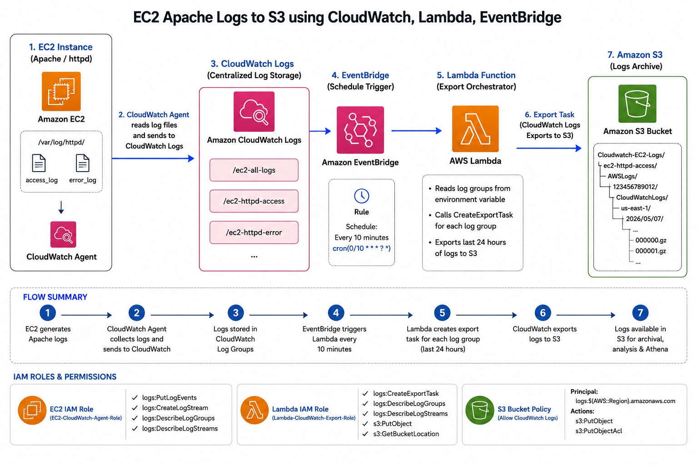

# CloudWatch Logs → S3 via EventBridge Scheduled Lambda

Automates the export of Amazon CloudWatch Log Groups to an S3 bucket on a recurring schedule. An EventBridge (CloudWatch Events) rule triggers a Lambda function at a defined interval. The Lambda function calls the CloudWatch Logs `CreateExportTask` API for each configured log group, writing the logs into a structured S3 prefix.



---

## How It Works

```
EventBridge Rule (cron/rate)
        │
        ▼
  Lambda Function
        │
        ├── Reads environment variables (log groups, S3 bucket, prefix, export window)
        │
        ├── Calculates time window: [now - EXPORT_HOURS  →  now]
        │
        └── For each LOG_GROUP_NAME:
                │
                ├── Calls CloudWatch Logs: CreateExportTask
                │       taskName  = <log-group>-<YYYYMMDD-HHMMSS>
                │       destination = S3_BUCKET_NAME
                │       destinationPrefix = S3_PREFIX/<log-group>
                │
                ├── Sleeps 5 s (avoids hitting the 1 concurrent export task limit)
                │
                └── Returns per-group SUCCESS / FAILED status
```

The Lambda processes each log group sequentially and adds a 5-second sleep between tasks. This is intentional — CloudWatch Logs only allows **one active export task per account at a time**.

---

## Project Structure

```
.
├── Lambda_function.py   # Lambda handler — core export logic
├── README.md            # This file
└── S3.jpg               # Architecture diagram
```

---

## Lambda Function — Code Walkthrough

### Imports & Client Setup

```python
import boto3
import os
from datetime import datetime, timedelta
import time

logs_client = boto3.client('logs')
```

A single `boto3` CloudWatch Logs client is created at module level (outside the handler) so it is reused across warm Lambda invocations.

### Environment Variables

```python
LOG_GROUP_NAMES = os.environ['LOG_GROUP_NAMES'].split(',')
S3_BUCKET_NAME  = os.environ['S3_BUCKET_NAME']
S3_PREFIX       = os.environ.get('S3_PREFIX', 'Cloudwatch-EC2-Logs/')
EXPORT_HOURS    = int(os.environ.get('EXPORT_HOURS', '24'))
```

`LOG_GROUP_NAMES` is a comma-separated string that is split into a list at cold-start time. `S3_PREFIX` and `EXPORT_HOURS` have safe defaults so they are technically optional.

### Handler Logic

```python
def lambda_handler(event, context):
    now           = datetime.utcnow()
    from_time     = now - timedelta(hours=EXPORT_HOURS)
    from_timestamp = int(from_time.timestamp() * 1000)   # milliseconds (required by API)
    to_timestamp   = int(now.timestamp()         * 1000)
```

The export window is always a rolling window of `EXPORT_HOURS` ending at the current UTC time.

For each log group, the function calls `create_export_task`:

```python
response = logs_client.create_export_task(
    taskName          = task_name,          # <log-group>-<timestamp>
    logGroupName      = log_group,
    fromTime          = from_timestamp,
    to                = to_timestamp,
    destination       = S3_BUCKET_NAME,
    destinationPrefix = f"{S3_PREFIX}{log_group}"
)
```

Exported logs land in S3 at the path:

```
s3://<S3_BUCKET_NAME>/<S3_PREFIX><log-group>/<export-task-id>/...
```

For example:

```
s3://my-log-archive/Cloudwatch-EC2-Logs/ec2-httpd-access/<task-id>/000000.gz
```

### Return Value

```json
{
  "statusCode": 200,
  "results": [
    { "logGroup": "ec2-all-logs",       "taskId": "abc-123", "status": "SUCCESS" },
    { "logGroup": "ec2-httpd-access",   "taskId": "def-456", "status": "SUCCESS" },
    { "logGroup": "ec2-httpd-error",    "status": "FAILED",  "error": "..." }
  ]
}
```

---

## Environment Variables

| Variable          | Required | Default                 | Description                                                                                 |
|-------------------|----------|-------------------------|---------------------------------------------------------------------------------------------|
| `LOG_GROUP_NAMES` | ✅ Yes   | —                       | Comma-separated list of CloudWatch Log Group names to export.                               |
| `S3_BUCKET_NAME`  | ✅ Yes   | —                       | Name of the destination S3 bucket (no `s3://` prefix).                                      |
| `S3_PREFIX`       | ❌ No    | `Cloudwatch-EC2-Logs/`  | S3 key prefix prepended to every exported log group folder.                                 |
| `EXPORT_HOURS`    | ❌ No    | `24`                    | Rolling export window in hours. The function exports logs from `now - N hours` up to `now`. |

### Example Values

| Variable          | Example Value                                   |
|-------------------|-------------------------------------------------|
| `LOG_GROUP_NAMES` | `ec2-all-logs,ec2-httpd-access,ec2-httpd-error` |
| `S3_BUCKET_NAME`  | `my-log-archive-bucket`                         |
| `S3_PREFIX`       | `Cloudwatch-EC2-Logs/`                          |
| `EXPORT_HOURS`    | `24`                                            |

---

## AWS Setup Guide

### 1. S3 Bucket — Bucket Policy

The destination S3 bucket must grant CloudWatch Logs permission to write objects. Attach the following bucket policy (replace placeholders):

```json
{
  "Version": "2012-10-17",
  "Statement": [
    {
      "Effect": "Allow",
      "Principal": {
        "Service": "logs.<AWS_REGION>.amazonaws.com"
      },
      "Action": "s3:GetBucketAcl",
      "Resource": "arn:aws:s3:::YOUR_BUCKET_NAME"
    },
    {
      "Effect": "Allow",
      "Principal": {
        "Service": "logs.<AWS_REGION>.amazonaws.com"
      },
      "Action": "s3:PutObject",
      "Resource": "arn:aws:s3:::YOUR_BUCKET_NAME/*",
      "Condition": {
        "StringEquals": {
          "s3:x-amz-acl": "bucket-owner-full-control"
        }
      }
    }
  ]
}
```

### 2. Lambda — IAM Execution Role

The Lambda execution role needs the following permissions:

```json
{
  "Version": "2012-10-17",
  "Statement": [
    {
      "Effect": "Allow",
      "Action": [
        "logs:CreateExportTask",
        "logs:DescribeExportTasks",
        "logs:DescribeLogGroups"
      ],
      "Resource": "*"
    },
    {
      "Effect": "Allow",
      "Action": [
        "s3:PutObject",
        "s3:GetBucketAcl"
      ],
      "Resource": [
        "arn:aws:s3:::YOUR_BUCKET_NAME",
        "arn:aws:s3:::YOUR_BUCKET_NAME/*"
      ]
    }
  ]
}
```

### 3. Lambda — Function Configuration

| Setting          | Recommended Value                         |
|------------------|-------------------------------------------|
| Runtime          | Python 3.11 (or later)                    |
| Handler          | `Lambda_function.lambda_handler`          |
| Timeout          | 5 minutes (to accommodate multiple groups + sleep delays) |
| Memory           | 128 MB (no heavy computation)             |

### 4. EventBridge Rule — Schedule

Create an EventBridge (formerly CloudWatch Events) rule to trigger the Lambda on your desired schedule.

**Rate expression (every 24 hours):**
```
rate(24 hours)
```

**Cron expression (daily at 01:00 UTC):**
```
cron(0 1 * * ? *)
```

Set the Lambda function as the rule target. No input transformation is required — the Lambda ignores the incoming event payload.

---

## Important Limitations

| Limitation | Details |
|---|---|
| **1 concurrent export task per account** | CloudWatch Logs only allows one active `CreateExportTask` at a time. The 5-second `time.sleep()` between log groups is a mitigation, but if a previous task is still running it will raise `LimitExceededException`. |
| **Export tasks are asynchronous** | `CreateExportTask` returns a `taskId` immediately; the actual data copy happens in the background. Logs may not appear in S3 instantly. |
| **Rolling window overlap** | Running every 24 hours with `EXPORT_HOURS=24` may result in slight overlap or gap depending on Lambda invocation timing. Adjust the schedule and window accordingly. |
| **No deduplication** | Re-running the function for an overlapping time window will create a new export task, potentially duplicating data in S3. |

---

## S3 Output Structure

```
s3://<S3_BUCKET_NAME>/
└── <S3_PREFIX>/
    ├── ec2-all-logs/
    │   └── <export-task-id>/
    │       ├── 000000.gz
    │       └── 000001.gz
    ├── ec2-httpd-access/
    │   └── <export-task-id>/
    │       └── 000000.gz
    └── ec2-httpd-error/
        └── <export-task-id>/
            └── 000000.gz
```

---

## License

This project is provided as-is for educational and operational reference purposes.
